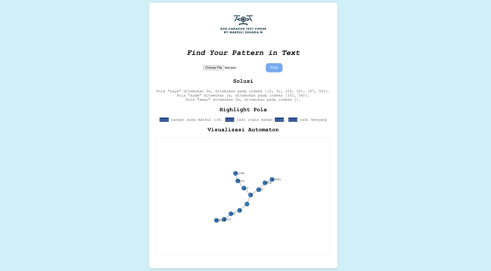

<!-- INTRO -->
<br />
<div align="center">
  <h1 align="center">Tugas 7 Seleksi IRK : </h1>

  <p align="center">
    <h3> Aho-Corasick Text Finder </h3>
    <p>Program made using Python for Backend & Javascript for Frontend</p>
    <br />
    <a href="https://github.com/zultopia/Task7-AhoCorasickTextFinder-13522070.git">Report Bug</a>
    ·
    <a href="https://github.com/zultopia/Task7-AhoCorasickTextFinder-13522070.git">Request Feature</a>
<br>
<br>

[![MIT License][license-shield]][license-url]

  </p>
</div>

<!-- CONTRIBUTOR -->
<div align="center" id="contributor">
  <strong>
    <h3>Dibuat oleh :</h3>
    <table align="center">
      <tr>
        <td>NIM</td>
        <td>Nama</td>
      </tr>
     <tr>
        <td>Marzuli Suhada M</td>
        <td>13522070</td>
    </tr>
    </table>
  </strong>
</div>

## Daftar Isi
* [Deskripsi Aplikasi](#deskripsi-aplikasi)
* [Algoritma yang Digunakan](#algoritma-yang-digunakan)
* [Struktur Program](#struktur-program)
* [Teknologi, Bahasa, dan Framework yang Digunakan](#teknologi-bahasa-dan-framework-yang-digunakan)
* [Cara Menjalankan Program](#cara-menjalankan-program)
* [Informasi Tambahan](#informasi-tambahan)
* [Referensi Belajar](#referensi-belajar)
* [Screenshot](#screenshot)
* [Licensing](#licensing)

## Deskripsi Aplikasi

Aho-Corasick Text Finder adalah aplikasi berbasis web yang menggunakan algoritma Aho-Corasick untuk mencari beberapa pola dalam sebuah teks. Aplikasi ini menampilkan hasil pencarian dan visualisasi automaton yang dihasilkan dari pola-pola yang diberikan.

## Algoritma Aho-Corasick

Algoritma Aho-Corasick adalah algoritma pencarian string yang efisien untuk menemukan semua kemunculan dari sekumpulan pola dalam sebuah teks. Algoritma ini membangun automaton (finite state machine) yang dapat dicari dalam waktu linear terhadap panjang teks.

## Struktur Program

```
    Aho-Corasick-Text-Finder/
    │
    ├── backend/
    │   ├── app.py          
    │   └── requirements.txt 
    │
    ├── frontend/
    │   ├── public/
    │   ├── src/
    │   │   ├── App.css  
    │   │   ├── App.js    
    |   │   ├── assets/  
    |   │   │   └── aho.png 
    |   │   ├── components/  
    |   │   │   └── FileUpload.js             
    │   │   └── ...          
    │   └── package.json     
    │
    ├── README.md            
    └── ...                  

```

## Teknologi, Bahasa, dan Framework yang Digunakan

1. Backend: Python, Flask
2. Frontend: JavaScript, React, D3.js
3. Dependencies: Tercantum dalam package.json

## Cara Menjalankan Program
1. Clone Repository
    ```
    git clone https://github.com/zultopia/Task7-AhoCorasickTextFinder-13522070.git
    ```

2. Menjalankan Backend
    - Pindah ke direktori backend
        ```
        cd backend
        ```
    - Jalankan server backend
        ```
        python3 app.py
        ```

3. Menjalankan Frontend
    - Pindah ke direktori frontend
        ```
        cd ../frontend
        ```
    - Install dependencies
        ```
        npm install 
        ```
    - Jalankan aplikasi frontend
        ```
        npm start
        ```
    - Aplikasi akan terbuka di browser pada alamat http://localhost:3000.

4. Pilih file .json yang ingin dicari solusinya. Contoh formatnya sebagai berikut.
    ```
    {
        "text": "saya sangat suka matkul irk. saya jadi ingin makan ayam. saya jadi kenyang",
        "patterns": ["saya", "ayam", "aman"]
        }  
    ```

5. Klik 'Find' untuk melihat solusi.

## Informasi Tambahan
1. Pastikan Python dan Node.js sudah terinstall pada sistem Anda sebelum menjalankan aplikasi.

2. Pastikan koneksi backend dan frontend sesuai dengan konfigurasi yang diinginkan.

## Referensi Belajar
1. [React Documentation](https://legacy.reactjs.org/docs/getting-started.html)
2. [D3.js Documentation](https://d3js.org/)
3. [Flask Documentation](https://flask.palletsprojects.com/en/3.0.x/)
4. [GeeksforGeeks - Aho-Corasick Algorithm](https://www.geeksforgeeks.org/aho-corasick-algorithm-pattern-searching/)

## Screenshot
<!-- GUI Illustration -->
<div align="center">
  <h2>Graphical User Interface (GUI) Program</h2>
  
</div>

<!-- LICENSE -->
## Licensing

The code in this project is licensed under MIT license.  

<br>
<h3 align="center"> THANK YOU! </h3>

<!-- MARKDOWN LINKS & IMAGES -->
<!-- https://www.markdownguide.org/basic-syntax/#reference-style-links -->
[license-shield]: https://img.shields.io/github/license/othneildrew/Best-README-Template.svg?style=for-the-badge
[license-url]: https://github.com/zultopia/Task7-AhoCorasickTextFinder-13522070/blob/main/LICENSE